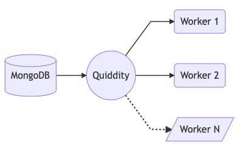

<div align="center">
  <br/>
  
  <br/>
  <br/>
  <p>
    Simple queue server that uses MongoDB to store messages
  </p>
  <br/>
</div>

---
### How it works

<div align="center">
  <br/>
  
</div>

- **Quiddity** is a simple server that connects to MongoDB and exposes few APIs like __*push*__, __*fetch*__ & __*delete*__.
- A seperate light-weight agent consumes these APIs and allows the user to push/pull messages from the queue.
- The user can also have multiple agents working on the queue.

---
### How to setup the server
Clone the __master__ branch of this repo
```
git clone --single-branch -b master https://github.com/thatsKevinJain/quiddity.git
```

Then run the start script -
```
npm start
```

You can also pass the following enviornment variables to configure the server.
|   Enviornment Name  |         Default Value        |      Datatype      |
|:-------------------:|:----------------------------:|:------------------:|
|         PORT        |             3000             |       Number       |
|      MONGO_URL      | "mongodb://localhost:27017/" |       String       |
| MESSAGE_EXPIRY_TIME |        300000 (5 mins)       | Number (in millis) |
|  MAX_PROCESS_COUNT  |               2              |       Number       |

#### Note -

- `MAX_PROCESS_COUNT`
	- Quiddity follows a __*atleast once*__ policy while processing messages.
	- This means your message can be processed more than once if the agent/worker fails to acknowledge the message.
  - Developers can set this count as **1** if they want to process their message only once.

- `MESSAGE_EXPIRY_TIME`
	- If the agent crashes or takes too long to acknowledge the job completion, the message is marked expired and put back into the queue.
	- Developers can extend this __*expiry time*__ if their messages take longer to process.


